# Golden benchmark runner

The runner evaluates Priorart end to end: optional query expansion, lexical and
dense retrieval, reciprocal-rank fusion, and optional reranking. It verifies
that the target repository is clean and checked out at the revision declared by
the suite.

Keep repository-specific suites private when their paths, queries, or issue
provenance are not suitable for publication.

## Results history

Evolution on the same frozen suite (`atlas-master-v1`, 20 real intent
queries against an ~8k-symbol codebase). Each full run is an end-to-end
evaluation: query expansion, lexical + dense retrieval, RRF fusion, rerank.
Runs 1–6 used the same remote model stack — `qwen3-embedding-8b`
(4096-d), `qwen3-reranker-8b`, `glm-5.3` for query expansion — so their
deltas reflect pipeline changes, not model changes. Runs 7–10 switch to a
fully local stack (llama.cpp on Apple M5: `Qwen3-Embedding-0.6B` +
`Qwen3-Reranker-4B` Q8_0, no LLM query expansion), trading latency for
autonomy. Result files for runs 1–2 were superseded and removed; run 3
reproduces their metrics with a self-contained candidate pool. "Index
warnings" counts partial parses of the same two test files surfaced since
run 2; run 5's artifact records them without query warnings.

| Run | Date | Recall@10 | MRR@10 | p50 | p95 | Index warnings |
|-----|------|----------:|-------:|----:|----:|----------------|
| 1 · first full baseline | 2026-09-19 | 0.70 | 0.457 | 8.9 s | 19.9 s | 0 |
| 2 · correctness hardening — `e32da78` | 2026-09-19 | 0.70 | 0.458 | 9.1 s | 17.3 s | 2 partial-parse surfaced |
| 3 · observability, traces + pool artifact | 2026-09-19 | 0.70 | 0.458 | 3.7 s | 16.3 s | 2 partial-parse |
| 4 · locator rerank documents | 2026-09-19 | 0.80 | 0.593 | 4.0 s | 19.0 s | 2 partial-parse |
| 5 · body rerank documents | 2026-09-19 | 0.85 | 0.806 | 6.7 s | 16.8 s | 2 partial-parse |
| 6 · pool expansion (file → owner) | 2026-09-19 | **0.95** | 0.814 | 13.5 s | 19.5 s | 2 partial-parse |
| 7 · local runtime — 0.6B rerank baseline | 2026-09-20 | 0.65 | 0.501 | 13.9 s | 15.9 s | 2 partial-parse |
| 8 · local 0.6B, instruct-nested query, pool 100 | 2026-09-20 | 0.75 | 0.508 | 17.8 s | 22.0 s | 2 partial-parse |
| 9 · local 4B reranker, completion-logprob scoring | 2026-09-20 | **0.90** | 0.715 | 41.3 s | 49.4 s | 2 partial-parse |
| 10 · local 4B, candidate pool 150 | 2026-09-20 | **0.90** | **0.756** | 85.5 s | 98.9 s | 2 partial-parse |

```mermaid
xychart-beta
    title "Retrieval quality by iteration (upper: Recall@10, lower: MRR@10)"
    x-axis ["baseline", "hardened", "pool", "locator", "body", "expansion", "local 0.6B", "local 0.6B instruct", "local 4B", "local 4B pool150"]
    y-axis "score" 0 --> 1
    bar [0.70, 0.70, 0.70, 0.80, 0.85, 0.95, 0.65, 0.75, 0.90, 0.90]
    bar [0.457, 0.458, 0.458, 0.593, 0.806, 0.814, 0.501, 0.508, 0.715, 0.756]
```

```mermaid
xychart-beta
    title "Query latency by iteration (upper: p95, lower: p50, seconds)"
    x-axis ["baseline", "hardened", "pool", "locator", "body", "expansion", "local 0.6B", "local 0.6B instruct", "local 4B", "local 4B pool150"]
    y-axis "seconds" 0 --> 110
    bar [8.9, 9.1, 3.7, 4.0, 6.7, 13.5, 13.9, 17.8, 41.3, 85.5]
    bar [19.9, 17.3, 16.3, 19.0, 16.8, 19.5, 15.9, 22.0, 49.4, 98.9]
```





**Iteration 1 — first full measurement.** The hybrid pipeline with remote
embedding + reranker models. 14 of 20 intent queries found the right reuse
point in the top 10; the misses were unattributable: the runner could not
tell retrieval failure from silent data loss.

**Iteration 2 — trustworthy by construction.** Correctness hardening across
indexing and search: safe file capture (bytes and metadata read from the same
open descriptor, symlinked parents refused), parse status made explicit
(`ok` / `partial` / `empty` / `unsupported` / `error`), rerank responses
validated as complete permutations before being trusted, reads executed in a
snapshot transaction scoped to one repository. Covered by a 60-test
regression suite with mutation testing in the gate.

**Iteration 3 — attributed misses.** Per-stage traces, loss-stage
classification, parse coverage, and a saved candidate pool (top-50 per query
with signatures and docstrings) turned every miss into an attributed event:
4 ranked deep, 1 cut at fusion, 1 never retrieved. The runner also records
an experiment manifest (revision, representation fingerprints, expansion
prompt hash). Quality is flat, as expected for an observability iteration;
latency improved with a warm self-hosted stack.

### Rerank document A/B

Frozen pools replayed through the rerank stage alone — no re-indexing,
no re-embedding, one variable changed. The first A/B used run 3's pool; the
second used run 4's pool (which carries full signatures):

| Format | Recall@10 | MRR@10 | Rerank p50 |
|--------|----------:|-------:|-----------:|
| A · `signature + docstring` (legacy) | 0.70 | 0.458 | 0.30 s |
| B · `path + qualname + kind + full signature + docstring` | **0.85** | **0.592** | 0.77 s |
| B on run 4's pool (control) | 0.85 | 0.598 | 0.76 s |
| C · B + body (≤ 3000 chars) | **0.90** | **0.813** | 2.81 s |

```mermaid
xychart-beta
    title "Rerank document format on the frozen pool"
    x-axis ["A · signature-docstring", "B · locator", "C · locator + body"]
    y-axis "score" 0 --> 1
    bar [0.70, 0.85, 0.90]
    bar [0.458, 0.598, 0.813]
```



Control A reproduced all 20 ranks of run 3 — the reranker is deterministic,
so the delta is attributable to the document format. The B control on run
4's pool reproduced 19 of 20 source ranks with one adjacent-rank boundary
flip (11→10), which bounds the observed rerank noise. B won on the three
target cases (49→9, 23→2, 9→2) plus two more, at the cost of one
out-of-top-10 regression (9→42, name-attraction: locator headers can promote
lexically similar symbols over the true owner) and two rank-1→2 shifts
inside the top 10.

The body budget curve on the same pool: 0 chars → 0.85/0.598, 400 →
0.85/0.689, 1200 → 0.85/0.747, 3000 → **0.90/0.813**, 6000 → 0.90/0.831.
Returns saturate past 3000 chars while p95 latency keeps growing, so 3000 is
the product budget. Body resolves the name-attraction regression (37→8: the
reranker can see which symbol actually owns the logic) and lifts every
improved-or-equal case with zero regressions. C is now the product rerank
document; the index stores source bodies (schema v4).

**Iteration 4 — locator rerank documents.** The rerank document changed from
`signature + docstring` to `path + qualname + kind + full signature +
docstring`, with full multi-line signatures stored in the index (schema v3).
First full end-to-end run with the new documents: 16/20 and MRR 0.593,
confirming the fixed-pool result (17/20) within query-expansion
non-determinism. Two gold symbols remain outside the candidate pool (planned
pool expansion); one miss ran with a disclosed expansion failure (transient
401, the query fell back to its raw form) and one is the known
name-attraction tradeoff of locator headers. The `rerank-b` replay artifact
links to run 3's pool via `manifest.replay`, so the format comparison stays
reproducible.

**Iteration 5 — body rerank documents.** The rerank document gained a bounded
source body (up to 3000 chars, cut at a line boundary with an explicit
truncation marker), stored in the index as the symbol's full source span
(schema v4). First full end-to-end run: 17/20 and MRR 0.806, confirming the
fixed-pool result (18/20, the pool ceiling) within query-expansion
non-determinism — the last miss sits at rank 12 in the product run vs 8 in
replay. The two pool-absent misses are unchanged (planned pool expansion).
Rerank latency roughly triples (p50 0.76 → 2.8 s per query on the replay
path), which the quality gain pays for. The `rerank-b-control` and
`rerank-c-body3000` replay artifacts link to run 4's published pool via
`manifest.replay`, and `body_from` records the snapshot the bodies were
extracted from.

Full per-case detail (top-50 candidates per query, traces, warnings,
latency) is in the result files in [`results/`](results/).

**Iteration 6 — pool expansion (file → owner).** A fresh control run of the
iteration-5 configuration reproduced 0.85/0.808 (same three losses: one cut at
fusion, one never retrieved, one ranked deep). Pool expansion then adds up to
50 further candidates: files of the fused top-50 pool are considered in order
of their best fused score, and per file at most 3 symbols missing from the
pool join it, ranked by distinct query terms matched in the body (prefix,
case-insensitive) with cosine similarity to the query as tie-breaker. Both
pool-absent golds entered via expansion and hit: the canonicalizer at rank 1
(its file's other symbols were already pooled while the owner itself never
made any per-stage top list) and the idempotent-insert owner at rank 7
(selected on body terms its signature does not carry). A third gold also
arrived via expansion at rank 1. Recall 0.85 → **0.95** (19/20, the rerank
ceiling now: the only remaining miss ranks 14th); four cases shifted by 1–2
positions, inside the established rerank noise bound. The rerank pool doubles
(50 → up to 100 documents), so query latency roughly doubles (p50 6.5 →
13.5 s, p95 18.1 → 19.5 s) — the quality gain pays for it. Expansion is on
by product default (`PRIORART_POOL_EXPANSION=false` disables it;
`--no-pool-expansion` is the benchmark control flag) and the trace records
the added symbol ids. The `remote-qwen3-8b-body-control` and
`remote-qwen3-8b-pool-expansion` artifacts were produced back to back on the
same index and model stack.

**Iterations 7–10 — fully local runtime.** The same suite end to end on a
local stack: two resident llama-server processes (Qwen3-Embedding-0.6B,
Qwen3-Reranker-4B Q8_0) on an Apple M5, LLM query expansion off. The 0.6B
baseline (run 7) retraced the remote gap — 0.65/0.501 with five
ranked-deep losses at full pool coverage — locating the bottleneck in
reranker precision, not retrieval. The best 0.6B query format
(instruction-nested, run 8, pool 100) recovered one case (0.75/0.508).
The 4B reranker could not use `--rerank --pooling rank`: llama.cpp v0.4.1's
embedding path diverges from the generational forward on this model
(byte-identical prompts, different yes/no logits; the 0.6B is unaffected),
so scoring moved client-side — the `llama-completion` protocol
(`PRIORART_RERANK_PROTOCOL=llama-completion`) builds the official Qwen3
judge prompt and reads P(yes)/(P(yes)+P(no)) from the first generated
token's logprobs. Run 9 (pool 50): 0.90/0.715 — every ranked-deep loss of
the 0.6B closed. Run 10 raised the fused pool to 150
(`PRIORART_CANDIDATE_LIMIT`, decoupled from output k): 0.90/0.756 against
the remote ceiling of 0.95/0.814; both remaining misses are
retrieval-stage (one gold outside the pool at dense rank >150, one at
rank 11), which no reranker can fix. Latency is the price of autonomy:
p50 85.5 s at pool 150 — one sequential `/completion` per document;
parallel scoring is the recorded next lever. Runs 9–10 used a fresh
body-v2 index (same corpus revision and coverage as runs 1–6); the
`local-qwen3-rerank4b-e1` and `local-qwen3-rerank4b-e1-pool150`
artifacts, plus the two 0.6B runs, are published in
[`results/`](results/).

## Suite format

```json
{
  "name": "repository-v1",
  "revision": "full-git-commit-sha",
  "cases": [
    {
      "id": "stable-case-id",
      "query": "Describe the code an agent plans to add without naming it",
      "expected": {
        "path": "src/package/module.py",
        "qualname": "ExistingClass.method"
      },
      "rationale": "Why this symbol is the correct reuse or extension point"
    }
  ]
}
```

Additional provenance fields are preserved in result JSON but are not required.

## Run

```bash
set -a; source .env; set +a
uv run python benchmarks/run.py \
  --suite /path/to/golden.json \
  --repo /path/to/frozen/repository \
  --label experiment-name \
  --rebuild
```

Results are written below `.bench/results/`. By default the runner uses a
model-specific ignored SQLite database, unless `PRIORART_DB` is set.

The reported metrics are recall@k, MRR@k, p50/p95 query latency, total query
time, and warning count. The first 50 reranked candidates are retained for
failure analysis while the default quality cutoff remains ten. Pool expansion
(product default) can be disabled for control runs with `--no-pool-expansion`;
the manifest records the expansion settings either way.

### Replay an A/B experiment

A saved pool can be re-ranked with a different rerank document format — no
indexing, no embedding, the rerank stage only:

```bash
uv run python benchmarks/run.py \
  --replay .bench/results/<pool-artifact>.json \
  --rerank-format path-qualname-kind-signature-docstring-body-v1 \
  --label my-experiment
```

Formats: `path-qualname-kind-signature-docstring-body-v1` (product),
`path-qualname-kind-signature-docstring-v1` (locator control) and
`signature-docstring-v1` (legacy control). Replays require an artifact from
the current runner (the pool must contain saved documents).

The body format needs a `body` field per candidate. Pools saved by the
current runner carry it; older pools can be enriched from the frozen
repository snapshot, which also makes the replay output self-contained:

```bash
uv run python benchmarks/run.py \
  --replay .bench/results/<pool-artifact>.json \
  --rerank-format path-qualname-kind-signature-docstring-body-v1 \
  --body-from /path/to/frozen/repository \
  --body-chars 3000
```

`--body-chars` bounds the body per document (default 3000, the product
budget); the manifest records the budget and the snapshot the bodies came
from.

Artifacts from pool-expansion runs save the top-50 of a rerank pool that
holds up to 100 candidates (fused top-50 plus expansion). Replays rerank
the saved 50: exact for document-format experiments, approximate for
pool-composition ones — a gold that entered the original pool below the
saved depth will read as `pool_absent`.

## Tracked obfuscated results

`benchmarks/results/` keeps the shareable result history in the repository.
Every file there is an obfuscated copy: organization and product names are
replaced with abstract placeholders, queries keep their original wording
otherwise. Raw results with original names stay under the ignored `.bench/`
directory.

Publish from a run:

```bash
uv run python benchmarks/run.py --suite ... --repo ... --publish
```

Or obfuscate existing artifacts without a rerun:

```bash
uv run python benchmarks/obfuscate.py .bench/results/*.json
```

The replacement vocabulary is private and must never enter the repository:
it lives in the ignored `.bench/obfuscation.json` as a JSON object mapping
sensitive terms to placeholders (`{"term": "placeholder"}`). Create it locally
before publishing; `--publish` and the CLI fail loudly when it is missing.
