# Golden benchmark runner

The runner evaluates Priorart end to end: optional query expansion, lexical and
dense retrieval, reciprocal-rank fusion, and optional reranking. It verifies
that the target repository is clean and checked out at the revision declared by
the suite.

Keep repository-specific suites private when their paths, queries, or issue
provenance are not suitable for publication.

## Results history

Evolution on the same frozen suite (`atlas-master-v1`, 20 real intent
queries against a ~7k-symbol codebase). Each full run is an end-to-end
evaluation: query expansion, lexical + dense retrieval, RRF fusion, rerank.
All runs used the same remote model stack — `qwen3-embedding-8b`
(4096-d), `qwen3-reranker-8b`, `glm-5.3` for query expansion — so the deltas
below reflect pipeline changes, not model changes. Result files for runs 1–2
were superseded and removed; run 3 reproduces their metrics with a
self-contained candidate pool.

| Run | Date | Recall@10 | MRR@10 | p50 | p95 | Index warnings |
|-----|------|----------:|-------:|----:|----:|----------------|
| 1 · first full baseline | 2026-09-19 | 0.70 | 0.457 | 8.9 s | 19.9 s | 0 |
| 2 · correctness hardening — `e32da78` | 2026-09-19 | 0.70 | 0.458 | 9.1 s | 17.3 s | 2 partial-parse surfaced |
| 3 · observability, traces + pool artifact | 2026-09-19 | 0.70 | 0.458 | 3.7 s | 16.3 s | 0 |
| 4 · locator rerank documents | 2026-09-19 | 0.80 | 0.593 | 4.0 s | 19.0 s | 0 |

```mermaid
xychart-beta
    title "Retrieval quality by iteration (upper: Recall@10, lower: MRR@10)"
    x-axis ["baseline", "hardened", "pool", "locator"]
    y-axis "score" 0 --> 0.9
    bar [0.70, 0.70, 0.70, 0.80]
    bar [0.457, 0.458, 0.458, 0.593]
```

```mermaid
xychart-beta
    title "Query latency by iteration (upper: p95, lower: p50, seconds)"
    x-axis ["baseline", "hardened", "pool", "locator"]
    y-axis "seconds" 0 --> 22
    bar [8.9, 9.1, 3.7, 4.0]
    bar [19.9, 17.3, 16.3, 19.0]
```





**Iteration 1 — first full measurement.** The hybrid pipeline with remote
embedding + reranker models. 14 of 20 intent queries found the right reuse
point in the top 10; the misses were unattributable: the runner could not
tell retrieval failure from silent data loss.

**Iteration 2 — trustworthy by construction.** Correctness hardening across
indexing and search: safe file capture (bytes and metadata read from the same
open descriptor, symlinked parents refused), parse status made explicit
(`ok` / `partial` / `empty` / `unsupported` / `error`), rerank responses
validated as complete permutations before being trusted, reads executed in a
snapshot transaction scoped to one repository. Covered by a 60-test
regression suite with mutation testing in the gate.

**Iteration 3 — attributed misses.** Per-stage traces, loss-stage
classification, parse coverage, and a saved candidate pool (top-50 per query
with signatures and docstrings) turned every miss into an attributed event:
4 ranked deep, 1 cut at fusion, 1 never retrieved. The runner also records
an experiment manifest (revision, representation fingerprints, expansion
prompt hash). Quality is flat, as expected for an observability iteration;
latency improved with a warm self-hosted stack.

### Rerank document A/B

Run 3's frozen pool replayed through the rerank stage alone — no re-indexing,
no re-embedding, one variable changed:

| Format | Recall@10 | MRR@10 | Rerank p50 |
|--------|----------:|-------:|-----------:|
| A · `signature + docstring` (legacy) | 0.70 | 0.458 | 0.30 s |
| B · `path + qualname + kind + full signature + docstring` | **0.85** | **0.592** | 0.77 s |

```mermaid
xychart-beta
    title "Rerank document format on the frozen pool"
    x-axis ["A · signature-docstring", "B · locator"]
    y-axis "score" 0 --> 1
    bar [0.70, 0.85]
    bar [0.458, 0.592]
```



Control A reproduced all 20 ranks of run 3 — the reranker is deterministic,
so the delta is attributable to the document format. B won on the three
target cases (49→9, 23→2, 9→2) plus two more, at the cost of one regression
(9→42, name-attraction: locator headers can promote lexically similar
symbols over the true owner). B is now the product rerank document; the
index stores full multi-line signatures (schema v3). Remaining misses: two
gold symbols absent from the pool, one ranked deep.

**Iteration 4 — locator rerank documents.** The rerank document changed from
`signature + docstring` to `path + qualname + kind + full signature +
docstring`, with full multi-line signatures stored in the index (schema v3).
First full end-to-end run with the new documents: 16/20 and MRR 0.593,
confirming the fixed-pool result (17/20) within query-expansion
non-determinism. Two gold symbols remain outside the candidate pool (planned
pool expansion); one miss ran with a disclosed expansion failure (transient
401, the query fell back to its raw form) and one is the known
name-attraction tradeoff of locator headers. The `rerank-b` replay artifact
links to run 3's pool via `manifest.replay`, so the format comparison stays
reproducible.

Full per-case detail (top-50 candidates per query, traces, warnings,
latency) is in the result files in [`results/`](results/).

## Suite format

```json
{
  "name": "repository-v1",
  "revision": "full-git-commit-sha",
  "cases": [
    {
      "id": "stable-case-id",
      "query": "Describe the code an agent plans to add without naming it",
      "expected": {
        "path": "src/package/module.py",
        "qualname": "ExistingClass.method"
      },
      "rationale": "Why this symbol is the correct reuse or extension point"
    }
  ]
}
```

Additional provenance fields are preserved in result JSON but are not required.

## Run

```bash
set -a; source .env; set +a
uv run python benchmarks/run.py \
  --suite /path/to/golden.json \
  --repo /path/to/frozen/repository \
  --label experiment-name \
  --rebuild
```

Results are written below `.bench/results/`. By default the runner uses a
model-specific ignored SQLite database, unless `PRIORART_DB` is set.

The reported metrics are recall@k, MRR@k, p50/p95 query latency, total query
time, and warning count. The first 50 reranked candidates are retained for
failure analysis while the default quality cutoff remains ten.

### Replay an A/B experiment

A saved pool can be re-ranked with a different rerank document format — no
indexing, no embedding, the rerank stage only:

```bash
uv run python benchmarks/run.py \
  --replay .bench/results/<pool-artifact>.json \
  --rerank-format path-qualname-kind-signature-docstring-v1 \
  --label my-experiment
```

Formats: `path-qualname-kind-signature-docstring-v1` (product) and
`signature-docstring-v1` (legacy control). Replays require an artifact from
the current runner (the pool must contain saved documents).

## Tracked obfuscated results

`benchmarks/results/` keeps the shareable result history in the repository.
Every file there is an obfuscated copy: organization and product names are
replaced with abstract placeholders, queries keep their original wording
otherwise. Raw results with original names stay under the ignored `.bench/`
directory.

Publish from a run:

```bash
uv run python benchmarks/run.py --suite ... --repo ... --publish
```

Or obfuscate existing artifacts without a rerun:

```bash
uv run python benchmarks/obfuscate.py .bench/results/*.json
```

The replacement vocabulary is private and must never enter the repository:
it lives in the ignored `.bench/obfuscation.json` as a JSON object mapping
sensitive terms to placeholders (`{"term": "placeholder"}`). Create it locally
before publishing; `--publish` and the CLI fail loudly when it is missing.
